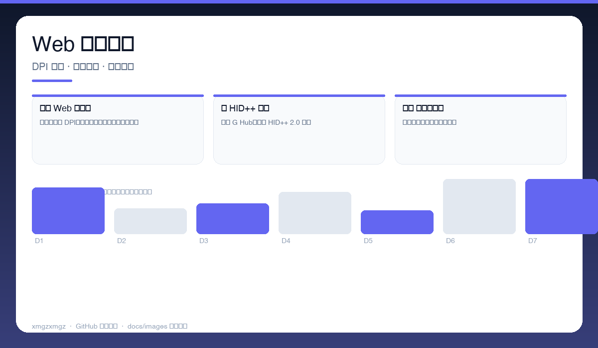
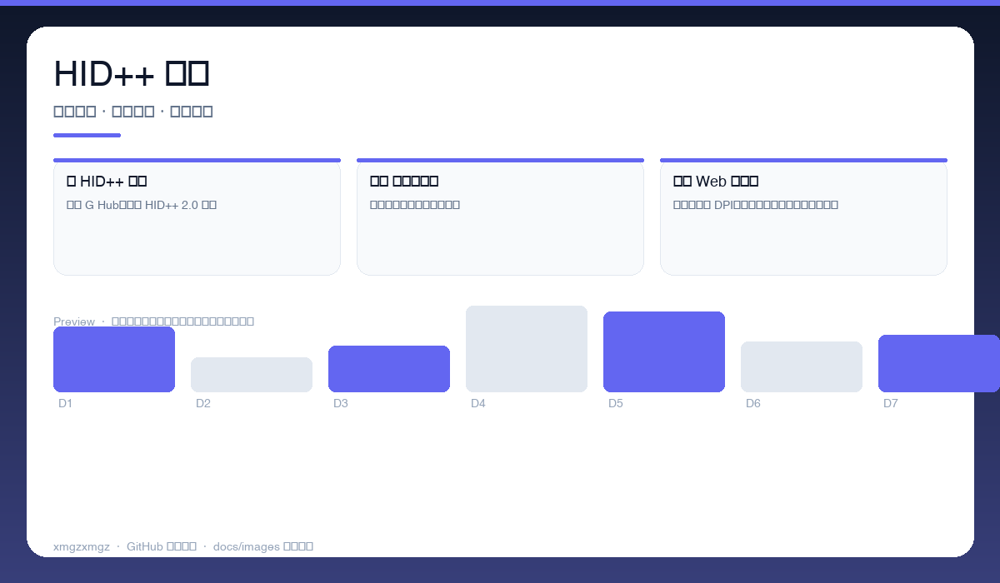
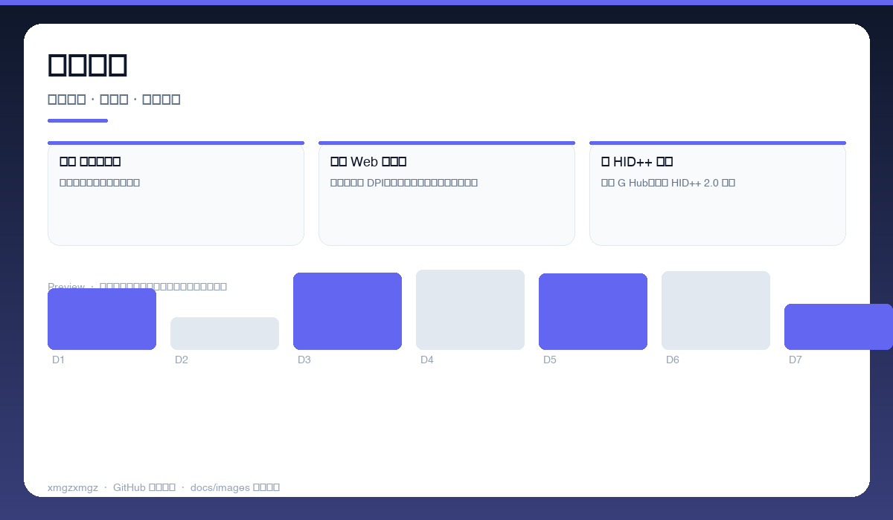

# 🖱️ LogiMac — logimac

> 在 Mac 上完全掌控罗技鼠标 — Web 面板可视化调 DPI、重映射按键。

[](https://github.com/xmgzxmgz/logimac)
[](https://github.com/xmgzxmgz/logimac/releases)
[](LICENSE)
[](https://github.com/xmgzxmgz/logimac/actions/workflows/release.yml)

---

## ✨ 功能一览

| 模块 | 能力 | 状态 |
|------|------|------|
| 🎛️ Web 可视化 | 浏览器里调 DPI、滚轮、按键映射，所见即所得 | ✅ |
| 🔌 HID++ 直连 | 绕过 G Hub，直连 HID++ 2.0 协议 | ✅ |
| ⌨️ 按键重映射 | 多按键、手势、宏一键配置 | ✅ |

---

## 📸 功能预览

> 以下为自动生成的示意预览（无需本地部署截图），展示核心功能形态。

| 总览 | 细节 | 流程 |
|------|------|------|
|  |  |  |
| Web 控制面板 · DPI 滑杆 · 按键映射 · 实时预览 | HID++ 连接 · 设备发现 · 协议握手 · 状态监控 | 手势与宏 · 手势录制 · 宏编辑 · 配置导出 |

<details>
<summary>查看大图</summary>


</details>

---

## 🚀 快速开始

```bash
npm install
npm run dev   # 打开 http://localhost:3000
npm run build
```

---

## 🛠 技术栈

TypeScript · HID++ 2.0 · WebHID · Node · Web UI

---

## 🗂️ 目录结构（节选）

```
logimac/
├── docs/images/        # 本 README 的三张自动生成预览图
├── .github/workflows/  # Auto Release 自动发版
├── README.md
└── ...                 # 源码与配置
```

---

## 📦 Releases

本仓库已启用 **Auto Release**（`.github/workflows/release.yml`）：

- 推送 `v*` tag 自动发版：`git tag v0.2.0 && git push origin v0.2.0`
- 手动触发：`gh workflow run "Auto Release" -f version=v0.2.0`（留空则自动 patch +1）
- 变更说明自动生成（`--generate-notes`）

前往 [Releases](https://github.com/xmgzxmgz/logimac/releases) 查看。

---

## 🙏 相关项目

- [workbuddy-account-hub](https://github.com/xmgzxmgz/workbuddy-account-hub) — WorkBuddy 账户中枢（本 README 的样板）
- 更多见 [xmgzxmgz 主页](https://github.com/xmgzxmgz)

---

## 许可

MIT
